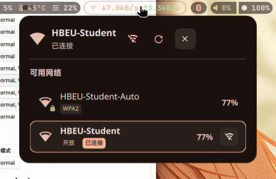

# Dotfiles 配置仓库
- preview




- 

这个仓库包含了我的开发环境配置文件，使用 GNU Stow 进行管理。

## 包含的配置

- **nvim** - Neovim 编辑器配置
- **starship** - Starship 提示符配置
- **tmux** - Tmux 终端复用器配置
- **yazi** - Yazi 文件管理器配置
- **zsh** - Zsh shell 配置
- waybar
- niri
- matugen
- quickshell

## 安装和使用

### 前置要求

- GNU Stow
- 相应的应用程序（neovim, starship, tmux, yazi, zsh）

### 安装步骤

1. 克隆仓库到本地：
   ```bash
   git clone <repository-url> ~/.dotfiles
   cd ~/.dotfiles
   ```

2. 使用 GNU Stow 创建符号链接：
   ```bash
   # 安装所有配置
   stow */
   
   # 或者单独安装特定配置
   stow nvim
   stow starship
   stow tmux
   stow yazi
   stow zsh
   ```

3. 重新加载 shell 配置：
   ```bash
   source ~/.zshrc
   ```

### 聚合脚本

仓库包含一个聚合脚本 `to_stow.sh`，用于从系统配置文件创建 dotfiles：

```bash
./to_stow.sh mainfest.txt
```

## 许可证

