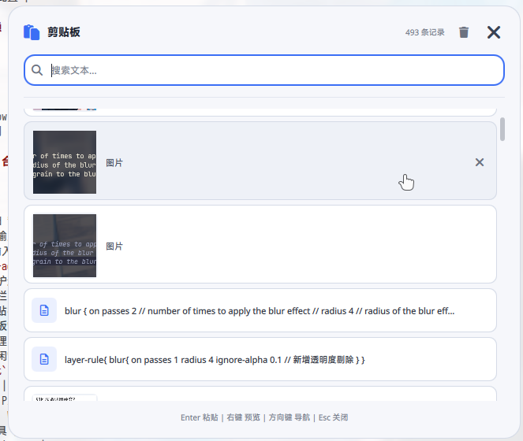
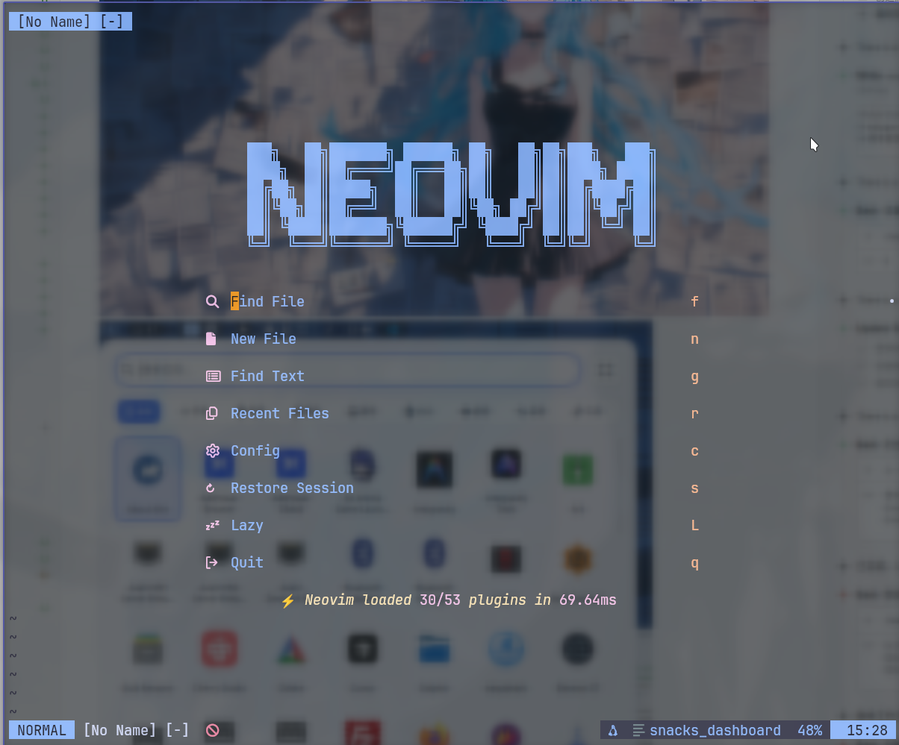

# Dotfiles 配置仓库






这个仓库包含了我的 Arch Linux 开发环境配置文件，使用 GNU Stow 进行管理。

## 目录

- [包含的配置](#包含的配置)
- [从零开始安装](#从零开始安装)
  - [第一步：安装基础工具](#第一步安装基础工具)
  - [第二步：克隆仓库](#第二步克隆仓库)
  - [第三步：安装依赖包](#第三步安装依赖包)
  - [第四步：应用配置](#第四步应用配置)
  - [第五步：初始化主题](#第五步初始化主题)
  - [第六步：配置 Shell](#第六步配置-shell)
  - [第七步：启动桌面环境](#第七步启动桌面环境)
- [依赖列表](#arch-linux-依赖)
- [环境变量配置](#环境变量)
- [常见问题](#常见问题)

## 包含的配置

| 配置 | 说明 | 文档 |
|------|------|------|
| **niri** | Niri Wayland 窗口管理器配置 | [README](niri/.config/niri/README.md) |
| **quickshell** | Quickshell QML 桌面组件配置 | [README](quickshell/.config/quickshell/README.md) |
| **waybar** | Waybar 状态栏配置 | [README](waybar/.config/waybar/README.md) |
| **matugen** | Matugen 主题生成器配置 | [README](matugen/.config/matugen/README.md) |
| **nvim** | Neovim 编辑器配置 | [README](nvim/.config/nvim/README.md) |
| **zsh** | Zsh shell 配置 | [README](zsh/.config/zsh/README.md) |
| **starship** | Starship 提示符配置 | [README](starship/.config/starship/README.md) |
| **tmux** | Tmux 终端复用器配置 | [README](tmux/.config/tmux/README.md) |
| **yazi** | Yazi 文件管理器配置 | [README](yazi/.config/yazi/README.md) |
| **kitty** | Kitty 终端模拟器配置 | [README](kitty/.config/kitty/README.md) |
| **my-scripts** | 自定义脚本集合 | [README](my-scripts/.custom/bin/README.md) |
| **font** | 字体配置 | [README](font/.config/fontconfig/README.md) |

## 从零开始安装

以下步骤适用于全新安装的 Arch Linux 系统。

### 第一步：安装基础工具

```bash
# 安装基础工具
sudo pacman -S git stow base-devel

# 安装 AUR 助手 (推荐 paru 或 yay)
git clone https://aur.archlinux.org/paru.git
cd paru && makepkg -si && cd .. && rm -rf paru

# 或者安装 yay
# git clone https://aur.archlinux.org/yay.git
# cd yay && makepkg -si && cd .. && rm -rf yay
```

### 第二步：克隆仓库

```bash
git clone <repository-url> ~/.dotfiles
cd ~/.dotfiles
```

### 第三步：安装依赖包

#### 一键安装所有依赖

```bash
# 核心依赖 (必须)
paru -S --needed \
    niri waybar quickshell-git \
    kitty zsh starship tmux neovim yazi \
    matugen swww swayidle hyprlock \
    fcitx5 fcitx5-im fcitx5-chinese-addons \
    wl-clipboard cliphist grim slurp wayfreeze \
    brightnessctl wireplumber pipewire \
    networkmanager bluez blueman \
    hyprpolkitagent xdg-desktop-portal xdg-desktop-portal-kde \
    python python-pip nodejs npm uv \
    ripgrep fd fzf bat eza zoxide jq curl wget \
    noto-fonts-cjk ttf-jetbrains-mono-nerd ttf-nerd-fonts-symbols-mono

# 可选依赖 (推荐)
paru -S --needed \
    firefox dolphin btop pavucontrol \
    ffmpegthumbnailer poppler imagemagick ffmpeg mpv \
    playerctl cava wf-recorder \
    atuin thefuck
```

#### 按模块安装依赖

<details>
<summary>点击展开各模块依赖</summary>

**Niri (Wayland 合成器)**
```bash
paru -S niri fcitx5 fcitx5-im fcitx5-chinese-addons \
    swww swayidle hyprlock brightnessctl wireplumber \
    wl-clipboard cliphist grim slurp wayfreeze \
    hyprpolkitagent xdg-desktop-portal xdg-desktop-portal-kde
```

**Waybar (状态栏)**
```bash
paru -S waybar playerctl cava wf-recorder jq \
    grim slurp wayfreeze brightnessctl
```

**Quickshell (桌面组件)**
```bash
paru -S quickshell-git ttf-nerd-fonts-symbols-mono \
    networkmanager bluez pipewire brightnessctl \
    cliphist wl-clipboard swww playerctl
# Python 依赖
cd ~/.config/quickshell && uv sync
```

**Matugen (主题生成)**
```bash
paru -S matugen
```

**Neovim (编辑器)**
```bash
paru -S neovim nodejs npm ripgrep fd bat fzf \
    tree-sitter clang stylua ruff pyright lua-language-server
```

**Zsh (Shell)**
```bash
paru -S zsh starship fzf fd ripgrep bat eza zoxide atuin thefuck
```

**Yazi (文件管理器)**
```bash
paru -S yazi ffmpegthumbnailer poppler jq imagemagick ffmpeg mpv
```

**Kitty (终端)**
```bash
paru -S kitty ttf-jetbrains-mono-nerd
```

**字体**
```bash
paru -S noto-fonts-cjk ttf-jetbrains-mono-nerd ttf-nerd-fonts-symbols-mono
```

</details>

### 第四步：应用配置

```bash
cd ~/.dotfiles

# 方式一：安装所有配置 (推荐)
stow */

# 方式二：单独安装需要的配置
stow niri
stow waybar
stow quickshell
stow matugen
stow nvim
stow zsh
stow starship
stow tmux
stow yazi
stow kitty
stow font
stow my-scripts
stow electron-flags
```

### 第五步：初始化主题

**重要**：首次安装必须初始化颜色文件，否则 Waybar、Quickshell 等组件会因缺少颜色文件而报错。

```bash
# 初始化默认颜色文件
~/.config/matugen/defaults/matugen-init -s

# 或者直接使用壁纸生成动态主题
matugen image /path/to/your/wallpaper.jpg
```

### 第六步：配置 Shell

```bash
# 设置 Zsh 为默认 shell
chsh -s /bin/zsh

# 创建 qs-popup 符号链接 (用于 Quickshell 弹窗)
mkdir -p ~/.local/bin
cat > ~/.local/bin/qs-popup << 'EOF'
#!/bin/bash
# QuickShell popup launcher
QS_CONFIG_DIR="$HOME/.config/quickshell"
COMPONENT="$1"
[[ -z "$COMPONENT" ]] && { echo "Usage: qs-popup <component>"; exit 0; }
shift
shell_path="$QS_CONFIG_DIR/$COMPONENT/shell.qml"
if pgrep -f "quickshell.*$COMPONENT/shell.qml" > /dev/null; then
    pkill -f "quickshell.*$COMPONENT/shell.qml"
else
    [[ -f "$shell_path" ]] && quickshell -p "$shell_path" &
fi
EOF
chmod +x ~/.local/bin/qs-popup

# 安装 Quickshell Python 依赖
cd ~/.config/quickshell && uv sync

# 重新登录或启动新终端
source ~/.zshrc
```

### 第七步：启动桌面环境

```bash
# 启用必要的系统服务
sudo systemctl enable --now NetworkManager
sudo systemctl enable --now bluetooth

# 从 TTY 启动 Niri
niri-session

# 或者配置显示管理器启动 Niri
# 在 /usr/share/wayland-sessions/ 创建 niri.desktop
```

## Arch Linux 依赖

### 核心工具

| 包名 | 用途 |
|------|------|
| `stow` | GNU Stow dotfiles 管理 |
| `git` | 版本控制 |
| `base-devel` | 编译工具链 |

### Niri (Wayland 合成器)

| 包名 | 用途 |
|------|------|
| `niri` | Wayland 窗口管理器 |
| `fcitx5` | 中文输入法 |
| `fcitx5-im` | 输入法集成 |
| `fcitx5-chinese-addons` | 中文输入法支持 |
| `swww` | 壁纸管理 |
| `swayidle` | 空闲管理 |
| `hyprlock` | 锁屏工具 |
| `hyprpolkitagent` | 权限认证 |
| `brightnessctl` | 亮度控制 |
| `wireplumber` | PipeWire 音频服务 |
| `wl-clipboard` | Wayland 剪贴板工具 |
| `cliphist` | 剪贴板历史 |
| `grim` | 截图工具 |
| `slurp` | 区域选择工具 |
| `wayfreeze` | 截图冻结工具 |
| `xdg-desktop-portal` | XDG Portal |
| `xdg-desktop-portal-kde` | KDE XDG Portal |

### Waybar

| 包名 | 用途 |
|------|------|
| `waybar` | 状态栏 |
| `playerctl` | 媒体控制 |
| `cava` | 音频可视化 |
| `wf-recorder` | 屏幕录制 |
| `jq` | JSON 处理 |

### Quickshell

| 包名 | 用途 |
|------|------|
| `quickshell-git` | QML 桌面组件框架 (AUR) |
| `ttf-nerd-fonts-symbols-mono` | Nerd Font 图标 |
| `uv` | Python 包管理器 |
| `networkmanager` | 网络管理 |
| `bluez` | 蓝牙协议栈 |

### Matugen

| 包名 | 用途 |
|------|------|
| `matugen` | 主题色生成器 |

### Neovim

| 包名 | 用途 |
|------|------|
| `neovim` | 编辑器 |
| `nodejs` | Neovim 插件依赖 |
| `npm` | Neovim 插件依赖 |
| `ripgrep` | 快速搜索 |
| `fd` | 文件查找 |
| `bat` | 文件查看 |
| `fzf` | 模糊查找 |
| `tree-sitter` | 语法高亮 |
| `clang` | C/C++ 编译器 |
| `stylua` | Lua 格式化 |
| `ruff` | Python Linter/Formatter |
| `pyright` | Python LSP |
| `lua-language-server` | Lua LSP |

### Shell

| 包名 | 用途 |
|------|------|
| `zsh` | Shell |
| `starship` | 提示符 |
| `eza` | 现代 ls 替代 |
| `bat` | 现代 cat 替代 |
| `fzf` | 模糊查找 |
| `ripgrep` | 快速搜索 |
| `fd` | 文件查找 |
| `zoxide` | 智能目录跳转 |
| `atuin` | 历史记录管理 |
| `thefuck` | 命令纠错 |

### Tmux

| 包名 | 用途 |
|------|------|
| `tmux` | 终端复用器 |

### Yazi

| 包名 | 用途 |
|------|------|
| `yazi` | 文件管理器 |
| `ffmpegthumbnailer` | 视频缩略图 |
| `poppler` | PDF 预览 |
| `imagemagick` | 图像处理 |
| `ffmpeg` | 视频处理 |
| `mpv` | 媒体播放 |

### Kitty

| 包名 | 用途 |
|------|------|
| `kitty` | 终端模拟器 |
| `ttf-jetbrains-mono-nerd` | Nerd Font 等宽字体 |

### 字体

| 包名 | 用途 |
|------|------|
| `noto-fonts-cjk` | 中文字体 |
| `ttf-jetbrains-mono-nerd` | Nerd Font 等宽字体 |
| `ttf-nerd-fonts-symbols-mono` | Nerd Font 图标 |

### 其他工具

| 包名 | 用途 |
|------|------|
| `firefox` | 浏览器 |
| `dolphin` | 文件管理器 |
| `btop` | 系统监控 |
| `pavucontrol` | 音频控制面板 |
| `blueman` | 蓝牙管理 |

## 环境变量

部分脚本需要设置以下环境变量（建议添加到 `~/.ssh/keys/keys.env`）：

```bash
# Gemini API 配置（用于 gtrans, gchat, gocr, cmdh 等脚本）
export G_API_URL="https://your-gemini-api-endpoint/v1/chat/completions"
export G_API_KEY="your-api-key"
export G_TEXT_MODEL="gemini-1.5-flash-latest"
export G_VISION_MODEL="gemini-1.5-pro-latest"
export G_TRANS_MODEL="gemini-1.5-flash-latest"

# 腾讯云 API 配置（用于 ttrans 脚本）
export T_SECRET_ID="your-secret-id"
export T_SECRET_KEY="your-secret-key"

# WiFi 登录配置（用于 wifi_login 脚本）
export WIFI_USERNAME="your-username"
export WIFI_PASSWORD="your-password"
```

## 聚合脚本

仓库包含一个聚合脚本 `to_stow.sh`，用于从系统配置文件创建 dotfiles：

```bash
./to_stow.sh mainfest.txt
```

## 常见问题

### Waybar/Quickshell 启动报错缺少颜色文件

运行 matugen 初始化脚本：

```bash
~/.config/matugen/defaults/matugen-init -s
```

### Quickshell 组件无法启动

1. 检查 quickshell 是否安装：`quickshell --version`
2. 检查 Python 依赖是否安装：`cd ~/.config/quickshell && uv sync`
3. 检查 qs-popup 脚本是否存在：`which qs-popup`

### Zsh 插件加载失败

Zi 插件管理器会在首次启动时自动安装，如果失败：

```bash
rm -rf ~/.local/share/zi
# 重新打开终端，Zi 会自动重新安装
```

### 图标显示为方块

安装 Nerd Fonts：

```bash
paru -S ttf-nerd-fonts-symbols-mono ttf-jetbrains-mono-nerd
```

### 中文输入法无法使用

确保 Fcitx5 环境变量正确设置（已在 niri 配置中自动设置）：

```bash
export GTK_IM_MODULE=fcitx
export QT_IM_MODULE=fcitx
export XMODIFIERS=@im=fcitx
```

### 蓝牙/WiFi 服务未启动

```bash
sudo systemctl enable --now NetworkManager
sudo systemctl enable --now bluetooth
```

## 许可证

MIT License
