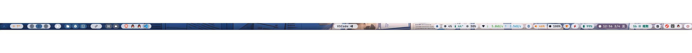
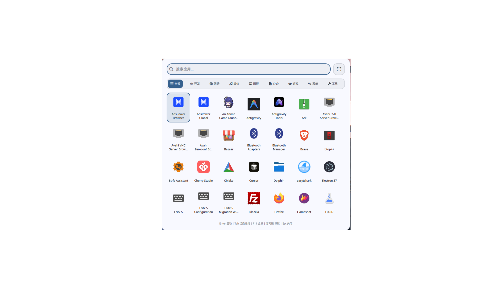
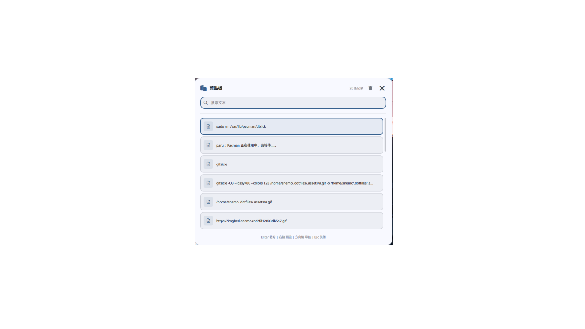
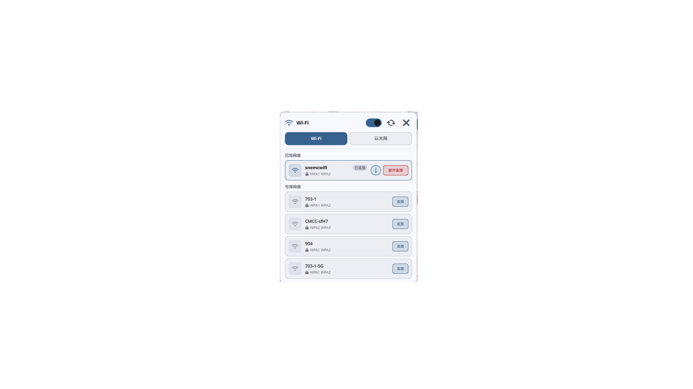
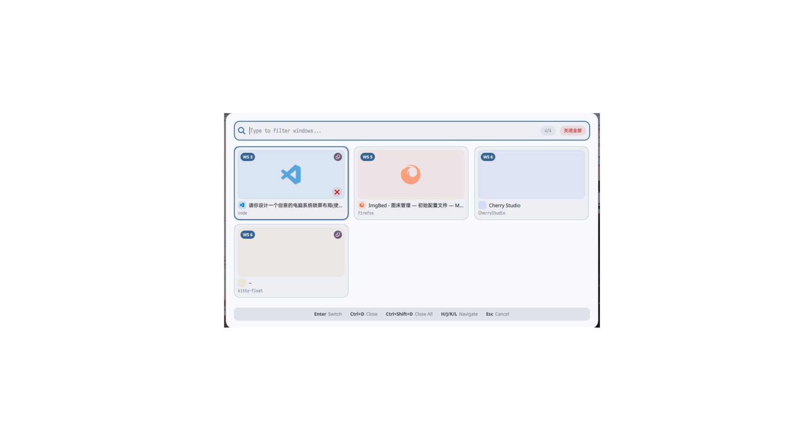
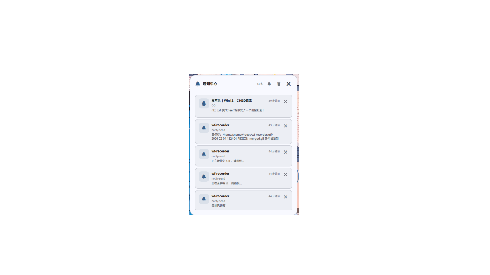
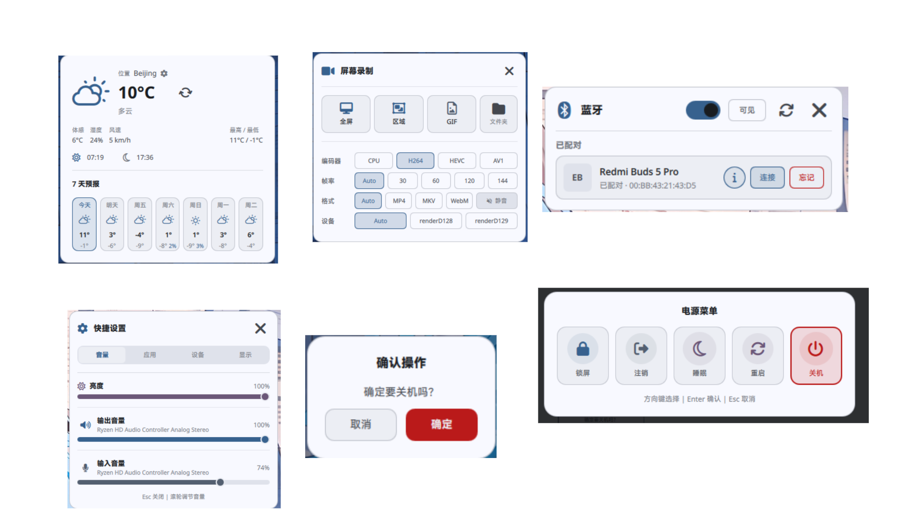

# Dotfiles 配置仓库

这个仓库包含了我的 Arch Linux 开发环境配置文件，使用 GNU Stow 进行管理。

## 特点

- **Quickshell 独立组件架构**：每个 UI 组件（启动器、日历、WiFi 管理等）都是独立进程，仅在调用时启动，用完即退出，不常驻内存
- **动态主题**：基于 Matugen 从壁纸提取配色，自动生成 Waybar、Quickshell 主题
- **Niri 平铺窗口管理器**：Wayland 原生，滚动式工作区布局
- **一键安装**：自动化脚本支持断点续传，从裸机到完整桌面环境

## 预览


<details>
<summary>桌面与状态栏</summary>

### 桌面


### Waybar 状态栏


</details>

<details>
<summary>Quickshell 组件</summary>

### 壁纸选择器


### 应用启动器


### 剪贴板管理


### WiFi 管理


### 日历


### 窗口切换器


### 通知中心


### 其他组件


</details>

## 目录

- [包含的配置](#包含的配置)
- [从零开始安装](#从零开始安装)
  - [一键安装脚本（推荐）](#一键安装脚本推荐)
  - [手动安装](#手动安装)
- [依赖列表](#arch-linux-依赖)
- [环境变量配置](#环境变量)
- [常见问题](#常见问题)

## 包含的配置

| 配置 | 说明 | 文档 |
|------|------|------|
| **niri** | Niri Wayland 窗口管理器配置 | [README](niri/.config/niri/README.md) |
| **quickshell** | Quickshell QML 桌面组件配置 | [README](quickshell/.config/quickshell/README.md) |
| **waybar** | Waybar 状态栏配置 | [README](waybar/.config/waybar/README.md) |
| **matugen** | Matugen 主题生成器配置 | [README](matugen/.config/matugen/README.md) |
| **nvim** | Neovim 编辑器配置 | [README](nvim/.config/nvim/README.md) |
| **zsh** | Zsh shell 配置 | [README](zsh/.config/zsh/README.md) |
| **starship** | Starship 提示符配置 | [README](starship/.config/starship/README.md) |
| **tmux** | Tmux 终端复用器配置 | [README](tmux/.config/tmux/README.md) |
| **yazi** | Yazi 文件管理器配置 | [README](yazi/.config/yazi/README.md) |
| **kitty** | Kitty 终端模拟器配置 | [README](kitty/.config/kitty/README.md) |
| **mpv** | MPV 媒体播放器配置（含 Anime4K） | [README](mpv/.config/mpv/README.md) |
| **sddm-theme** | SDDM 登录主题 (lunar-glass) | [README](sddm-theme/README.md) |
| **my-scripts** | 自定义脚本集合 | [README](my-scripts/.custom/bin/README.md) |
| **font** | 字体配置 | [README](font/.config/fontconfig/README.md) |

## 从零开始安装

以下步骤适用于全新安装的 Arch Linux 系统。

### 一键安装脚本（推荐）

仓库提供自动化安装脚本，可一键完成所有配置：

```bash
# 短链接（推荐，方便记忆）
bash <(curl -fsSL https://v.gd/snemc_setup)

# 或者使用完整链接
bash <(curl -fsSL https://raw.githubusercontent.com/jswysnemc/dotfiles/main/install.sh)

# 或者克隆后运行
git clone https://github.com/jswysnemc/dotfiles ~/.dotfiles
cd ~/.dotfiles
./install.sh
```

#### 安装脚本功能

| 阶段 | 功能 |
|------|------|
| Pre-Flight | 系统检查（Arch Linux、网络、非 root） |
| Phase 1 | 安装基础工具（git、stow、base-devel） |
| Phase 2 | 安装 AUR 助手（paru，通过 archlinuxcn 镜像） |
| Phase 3 | 克隆 dotfiles 仓库 |
| Phase 4 | 安装核心包组（窗口管理器、终端、主题等） |
| Phase 4b | 安装 AUR 包（quickshell、xwayland-satellite 等） |
| Phase 4c | 可选包（交互式选择） |
| Phase 5 | 使用 stow 应用配置文件 |
| Phase 6a | Neovim 编辑器（可选，含 lazy.nvim 自动 bootstrap） |
| Phase 6b | Zsh Shell（可选，含 .zshenv 自动创建） |
| Phase 6c | Tmux 终端复用器（可选） |
| Phase 6d | MPV 媒体播放器（可选，含 Anime4K 着色器） |
| Phase 7 | Quickshell 配置与 PAM 锁屏 |
| Phase 8 | Matugen 主题生成 + GTK/Qt 主题配置 |
| Phase 9 | 启用系统服务（NetworkManager、蓝牙） |
| Phase 9b | SDDM 显示管理器（可选，含 lunar-glass 主题） |
| Phase 9c | Yazi 文件管理器（可选） |
| Phase 10 | 创建用户目录、复制壁纸 |

#### 安装后启动

安装脚本会询问是否安装 SDDM 显示管理器：

- **选择安装 SDDM**：重启后自动显示图形登录界面，选择 Niri 会话登录即可
- **不安装 SDDM**：需要手动从 TTY 启动桌面

```bash
# 如果没有安装 SDDM，手动启动桌面：
# 1. 重启系统
# 2. 在 TTY 登录界面输入用户名和密码
# 3. 启动 niri 桌面
niri-session
```

#### 安装选项

```bash
./install.sh              # 完整安装（推荐）
./install.sh --minimal    # 最小安装（跳过可选包）
./install.sh --no-aur     # 跳过 AUR 助手安装
./install.sh --no-stow    # 跳过配置文件部署
./install.sh --reset      # 清除进度，重新开始
```

> 脚本支持断点续传：如果安装中断，重新运行会自动跳过已完成的步骤。

---

### 手动安装

如果不使用自动脚本，可按以下步骤手动安装。

#### 第一步：安装基础工具

```bash
# 安装基础工具
sudo pacman -S git stow base-devel

# 安装 AUR 助手 (推荐 paru 或 yay)
git clone https://aur.archlinux.org/paru.git
cd paru && makepkg -si && cd .. && rm -rf paru

# 或者安装 yay
# git clone https://aur.archlinux.org/yay.git
# cd yay && makepkg -si && cd .. && rm -rf yay
```

#### 第二步：克隆仓库

```bash
git clone https://github.com/jswysnemc/dotfiles ~/.dotfiles
cd ~/.dotfiles
```

#### 第三步：安装依赖包

##### 一键安装所有依赖

```bash
# 核心依赖 (必须)
paru -S --needed \
    niri waybar quickshell \
    kitty zsh starship tmux neovim yazi dolphin \
    matugen kvantum qt5ct qt6ct swww swayidle \
    fcitx5 fcitx5-im fcitx5-chinese-addons \
    wl-clipboard cliphist grim slurp wayfreeze xclip \
    wireplumber pipewire pipewire-pulse pipewire-alsa playerctl \
    networkmanager bluez bluez-utils \
    hyprpolkitagent xdg-desktop-portal xdg-desktop-portal-gtk xdg-desktop-portal-kde \
    fuzzel libnotify brightnessctl \
    python python-pip nodejs npm \
    ripgrep fd fzf bat eza zoxide jq curl wget unzip psmisc gawk \
    noto-fonts-cjk ttf-jetbrains-mono-nerd ttf-nerd-fonts-symbols-mono \
    papirus-icon-theme phinger-cursors

# AUR 包
paru -S --needed \
    uv xwayland-satellite clipse clipnotify \
    catppuccin-gtk-theme-latte catppuccin-gtk-theme-mocha \
    catppuccin-cursors-latte kvantum-theme-matchama

# 可选依赖 (推荐)
paru -S --needed \
    firefox firefox-i18n-zh-cn btop pavucontrol blueman \
    ffmpegthumbnailer poppler imagemagick ffmpeg mpv \
    cava wf-recorder atuin thefuck \
    tree-sitter-cli clang stylua ruff pyright lua-language-server
```

##### 按模块安装依赖

<details>
<summary>点击展开各模块依赖</summary>

**Niri (Wayland 合成器)**
```bash
paru -S niri fcitx5 fcitx5-im fcitx5-chinese-addons \
    swww swayidle hyprpolkitagent brightnessctl wireplumber \
    wl-clipboard cliphist grim slurp wayfreeze xclip \
    xdg-desktop-portal xdg-desktop-portal-gtk xdg-desktop-portal-kde \
    xwayland-satellite
```

**Waybar (状态栏)**
```bash
paru -S waybar playerctl cava wf-recorder jq \
    grim slurp wayfreeze brightnessctl
```

**Quickshell (桌面组件)**
```bash
paru -S quickshell ttf-nerd-fonts-symbols-mono \
    networkmanager bluez pipewire brightnessctl \
    cliphist wl-clipboard swww playerctl uv
# Python 依赖
cd ~/.config/quickshell && uv sync
```

**Matugen (主题生成)**
```bash
paru -S matugen kvantum qt5ct qt6ct
```

**Neovim (编辑器)**
```bash
paru -S neovim nodejs npm ripgrep fd bat fzf \
    tree-sitter-cli clang stylua ruff pyright lua-language-server
```

**Zsh (Shell)**
```bash
paru -S zsh starship fzf fd ripgrep bat eza zoxide atuin thefuck
```

**Yazi (文件管理器)**
```bash
paru -S yazi dolphin ffmpegthumbnailer poppler jq imagemagick ffmpeg mpv
```

**Kitty (终端)**
```bash
paru -S kitty ttf-jetbrains-mono-nerd
```

**字体**
```bash
paru -S noto-fonts-cjk ttf-jetbrains-mono-nerd ttf-nerd-fonts-symbols-mono
```

**外观主题**
```bash
paru -S papirus-icon-theme phinger-cursors \
    catppuccin-gtk-theme-latte catppuccin-gtk-theme-mocha \
    catppuccin-cursors-latte kvantum-theme-matchama
```

</details>

#### 第四步：应用配置

```bash
cd ~/.dotfiles

# 方式一：安装所有配置 (推荐)
stow */

# 方式二：单独安装需要的配置
stow niri
stow waybar
stow quickshell
stow matugen
stow nvim
stow zsh
stow starship
stow tmux
stow yazi
stow kitty
stow font
stow my-scripts
stow electron-flags
```

#### 第五步：初始化主题

**重要**：首次安装必须初始化颜色文件，否则 Waybar、Quickshell 等组件会因缺少颜色文件而报错。

```bash
# 初始化默认颜色文件
~/.config/matugen/defaults/matugen-init -s

# 或者直接使用壁纸生成动态主题
matugen image /path/to/your/wallpaper.jpg
```

#### 第六步：配置 Shell

```bash
# 设置 Zsh 为默认 shell
chsh -s /bin/zsh

# 创建 qs-popup 符号链接 (用于 Quickshell 弹窗)
mkdir -p ~/.local/bin
# 复制仓库的 `.dotfiles/local-bin` 下的所有脚本到  `~/.local/bin`


# 安装 Quickshell Python 依赖
cd ~/.config/quickshell && uv sync

# 重新登录或启动新终端
source ~/.zshrc
```

#### 第七步：启动桌面环境

```bash
# 启用必要的系统服务
sudo systemctl enable --now NetworkManager
sudo systemctl enable --now bluetooth

# 重启系统
sudo reboot

# 重启后在 TTY 登录界面输入用户名和密码
# 然后启动 niri 桌面
niri-session
```

> 提示：如果安装了 SDDM，重启后会自动显示图形登录界面。

## Arch Linux 依赖

### 核心工具

| 包名 | 用途 |
|------|------|
| `stow` | GNU Stow dotfiles 管理 |
| `git` | 版本控制 |
| `base-devel` | 编译工具链 |

### Niri (Wayland 合成器)

| 包名 | 用途 |
|------|------|
| `niri` | Wayland 窗口管理器 |
| `xwayland-satellite` | XWayland 兼容层（AUR） |
| `fcitx5` | 中文输入法 |
| `fcitx5-im` | 输入法集成 |
| `fcitx5-chinese-addons` | 中文输入法支持 |
| `swww` | 壁纸管理 |
| `swayidle` | 空闲管理 |
| `hyprpolkitagent` | 权限认证 |
| `brightnessctl` | 亮度控制 |
| `wireplumber` | PipeWire 音频服务 |
| `wl-clipboard` | Wayland 剪贴板工具 |
| `xclip` | X11 剪贴板工具 |
| `cliphist` | 剪贴板历史 |
| `clipse` | 剪贴板管理器（AUR） |
| `clipnotify` | 剪贴板事件监听（AUR） |
| `grim` | 截图工具 |
| `slurp` | 区域选择工具 |
| `wayfreeze` | 截图冻结工具 |
| `xdg-desktop-portal` | XDG Portal |
| `xdg-desktop-portal-gtk` | GTK XDG Portal |
| `xdg-desktop-portal-kde` | KDE XDG Portal（AUR） |

### Waybar

| 包名 | 用途 |
|------|------|
| `waybar` | 状态栏 |
| `playerctl` | 媒体控制 |
| `cava` | 音频可视化 |
| `wf-recorder` | 屏幕录制 |
| `jq` | JSON 处理 |

### Quickshell

| 包名 | 用途 |
|------|------|
| `quickshell` | QML 桌面组件框架 (AUR) |
| `ttf-nerd-fonts-symbols-mono` | Nerd Font 图标 |
| `uv` | Python 包管理器 (AUR) |
| `networkmanager` | 网络管理 |
| `bluez` | 蓝牙协议栈 |
| `bluez-utils` | 蓝牙工具 |

### Matugen 与主题

| 包名 | 用途 |
|------|------|
| `matugen` | 主题色生成器 |
| `kvantum` | Qt 主题引擎 |
| `qt5ct` | Qt5 配置工具 |
| `qt6ct` | Qt6 配置工具 |
| `kvantum-theme-matchama` | Matchama Kvantum 主题 (AUR) |
| `catppuccin-gtk-theme-latte` | Catppuccin GTK 主题 (AUR) |
| `catppuccin-gtk-theme-mocha` | Catppuccin GTK 主题 (AUR) |
| `papirus-icon-theme` | Papirus 图标主题 |
| `phinger-cursors` | Phinger 光标主题 |
| `catppuccin-cursors-latte` | Catppuccin 光标主题 (AUR) |

### Neovim

| 包名 | 用途 |
|------|------|
| `neovim` | 编辑器 |
| `nodejs` | Neovim 插件依赖 |
| `npm` | Neovim 插件依赖 |
| `ripgrep` | 快速搜索 |
| `fd` | 文件查找 |
| `bat` | 文件查看 |
| `fzf` | 模糊查找 |
| `tree-sitter-cli` | 语法高亮 |
| `clang` | C/C++ 编译器 |
| `stylua` | Lua 格式化 |
| `ruff` | Python Linter/Formatter |
| `pyright` | Python LSP |
| `lua-language-server` | Lua LSP |

### Shell

| 包名 | 用途 |
|------|------|
| `zsh` | Shell |
| `starship` | 提示符 |
| `eza` | 现代 ls 替代 |
| `bat` | 现代 cat 替代 |
| `fzf` | 模糊查找 |
| `ripgrep` | 快速搜索 |
| `fd` | 文件查找 |
| `zoxide` | 智能目录跳转 |
| `atuin` | 历史记录管理 |
| `thefuck` | 命令纠错 |

### Tmux

| 包名 | 用途 |
|------|------|
| `tmux` | 终端复用器 |

### Yazi

| 包名 | 用途 |
|------|------|
| `yazi` | 文件管理器 |
| `dolphin` | KDE 文件管理器 |
| `ffmpegthumbnailer` | 视频缩略图 |
| `poppler` | PDF 预览 |
| `imagemagick` | 图像处理 |
| `ffmpeg` | 视频处理 |
| `mpv` | 媒体播放 |

### Kitty

| 包名 | 用途 |
|------|------|
| `kitty` | 终端模拟器 |
| `ttf-jetbrains-mono-nerd` | Nerd Font 等宽字体 |

### 字体

| 包名 | 用途 |
|------|------|
| `noto-fonts-cjk` | 中文字体 |
| `ttf-jetbrains-mono-nerd` | Nerd Font 等宽字体 |
| `ttf-nerd-fonts-symbols-mono` | Nerd Font 图标 |

### 其他工具

| 包名 | 用途 |
|------|------|
| `firefox` | 浏览器 |
| `firefox-i18n-zh-cn` | Firefox 中文语言包 |
| `btop` | 系统监控 |
| `pavucontrol` | 音频控制面板 |
| `blueman` | 蓝牙管理 |
| `fuzzel` | 应用启动器 |
| `libnotify` | 通知库 |

## 环境变量

部分脚本需要设置以下环境变量（建议添加到 `~/.ssh/keys/keys.env`）：

```bash
# Gemini API 配置（用于 gtrans, gchat, gocr, cmdh 等脚本）
export G_API_URL="https://your-gemini-api-endpoint/v1/chat/completions"
export G_API_KEY="your-api-key"
export G_TEXT_MODEL="gemini-1.5-flash-latest"
export G_VISION_MODEL="gemini-1.5-pro-latest"
export G_TRANS_MODEL="gemini-1.5-flash-latest"

# 腾讯云 API 配置（用于 ttrans 脚本）
export T_SECRET_ID="your-secret-id"
export T_SECRET_KEY="your-secret-key"

# WiFi 登录配置（用于 wifi_login 脚本）
export WIFI_USERNAME="your-username"
export WIFI_PASSWORD="your-password"
```

## 聚合脚本

仓库包含一个聚合脚本 `to_stow.sh`，用于从系统配置文件创建 dotfiles：

```bash
./to_stow.sh mainfest.txt
```

## 常见问题

### Waybar/Quickshell 启动报错缺少颜色文件

运行 matugen 初始化脚本：

```bash
~/.config/matugen/defaults/matugen-init -s
```

### Quickshell 组件无法启动

1. 检查 quickshell 是否安装：`quickshell --version`
2. 检查 Python 依赖是否安装：`cd ~/.config/quickshell && uv sync`
3. 检查 qs-popup 脚本是否存在：`which qs-popup`

### Zsh 插件加载失败

Zi 插件管理器会在首次启动时自动安装，如果失败：

```bash
rm -rf ~/.local/share/zi
# 重新打开终端，Zi 会自动重新安装
```

### 图标显示为方块

安装 Nerd Fonts：

```bash
paru -S ttf-nerd-fonts-symbols-mono ttf-jetbrains-mono-nerd
```

### 中文输入法无法使用

确保 Fcitx5 环境变量正确设置（已在 niri 配置中自动设置）：

```bash
export GTK_IM_MODULE=fcitx
export QT_IM_MODULE=fcitx
export XMODIFIERS=@im=fcitx
```

### 蓝牙/WiFi 服务未启动

```bash
sudo systemctl enable --now NetworkManager
sudo systemctl enable --now bluetooth
```

## 许可证

MIT License
